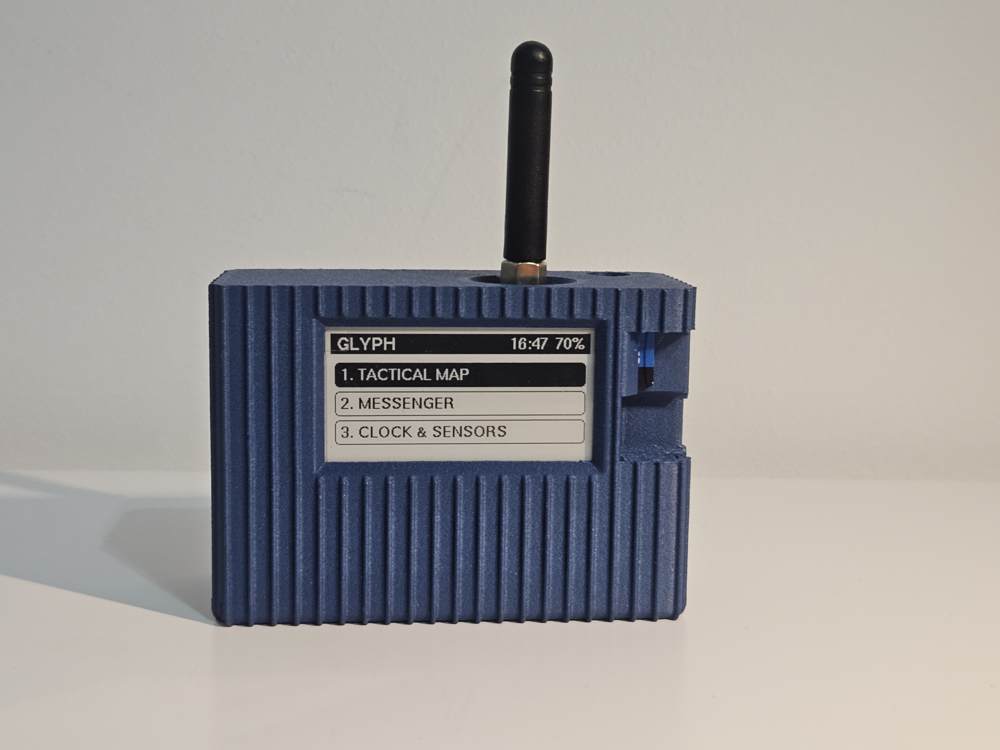

# 🛰️ GLYPH OS

### The 100% Plug & Play, Zero-Soldering Tactical Communicator

  
  
  
  
  

  
  
  
  
  

**An ESP32-S3 dual-core tactical operating system for extreme operations.** Military-grade AES-256-CBC encryption • Offline GNSS navigation • Real-time team tracking • Ultra-low-power E-Ink display • Multi-language support.

**Build your own off-grid military-grade communicator in under 45 minutes using standard Qwiic modules and a 3D printer. No soldering required.**

[📥 Download](https://github.com/Mqr1oo/GLYPH/releases) • [📖 Documentation](#-documentation) • [🧰 Bill of Materials](#-hardware--bill-of-materials) • [🐛 Report Bug](https://github.com/Mqr1oo/GLYPH/issues)

---

## 📸 Screenshots & Demo

> **Add your device photos here**
> 
> 
> 
> 
> 

---

## 🎯 Why GLYPH OS?

GLYPH is a self-contained, off-grid communication system designed for scenarios where cellular networks fail - tactical operations, extreme hiking, search & rescue, and disaster response. Think of it as a **military-grade walkie-talkie meets GPS tracker**, heavily focused on secure LoRa messaging and highly accurate GPS breadcrumbs.

The revolutionary aspect? **It's entirely Plug & Play.** We designed GLYPH so that anyone with a 3D printer can build their own tactical communication device in under an hour. **No soldering iron. No technical skills required. Just plug and go.**

- 🔌 **True Plug & Play** - Uses Qwiic connectors throughout. Assemble it in 30-45 minutes.
- 🔒 **Military-Grade Encryption** - AES-256-CBC with SHA-256 key derivation from team names.
- 📡 **Long-Range LoRa** - 10km+ range without any infrastructure (up to 20km in emergency mode).
- 🗺️ **Offline GPS Tracking** - Smart breadcrumb trail with <20cm noise filtering.
- 👥 **Team Awareness** - Track 5 teammates entirely offline based on LoRa coordinates.
- 🔋 **Intelligent Power Management** - 18h (TACTICAL) → 36h (ECO) → 7 days (STEALTH).
- 🖨️ **Bambu Lab Optimized** - Rugged PETG CF body with TPU button caps via AMS.
- 🌍 **Multi-Language** - 11 languages supported.

---

## 📑 Table of Contents

- [🔥 Core Capabilities](#-core-capabilities)
  - [🗺️ Tactical Map & Navigation](#️-tactical-map--navigation)
  - [📡 Encrypted LoRa Messenger](#-encrypted-lora-messenger)
  - [👥 Team Radar](#-team-radar)
- [🥷 Power Management](#-power-management)
- [🧰 Hardware & Bill of Materials](#-hardware--bill-of-materials)
- [🆘 Emergency Features](#-emergency-features)
- [📄 License](#-license)

---

## 🔥 Core Capabilities

### 🗺️ Tactical Map & Navigation

**Smart GPS Breadcrumb System**
- **Noise Filtering**: Only records true movement.
- **Breadcrumb Buffer**: Stores up to 350 waypoints in RTC memory (survives deep sleep).
- **Automatic Logging**: Real-time KML route recording to SD card (compatible with Google Earth and ATAK).

**KML Route Overlay System**
- Load pre-planned routes from SD card for mission planning.
- Automatic bounding box calculation and distance pre-calculation.

**Triple Zoom System**
| Zoom Level | Description | Use Case |
|------------|-------------|----------|
| **FIT** | Auto-zoom to show entire route + KML | Route overview, mission planning |
| **ZOOM** | Fixed ~20m radius around position | Close navigation, tactical ops |
| **TACTICAL** | Dynamic zoom based on activity | General navigation |

### 📡 Encrypted LoRa Messenger

**Military-Grade Encryption**
> AES-256-CBC Implementation
> Key Generation: SHA-256(Team Name) → 256-bit key
> IV: Random 16 bytes per message
> Padding: PKCS#7 standard

**Transmission Protocol**
- Dynamic IV prevents replay attacks.
- Team-based encryption (different teams = different keys).
- Automatic GPS coordinates embedded in every message.

**Spread Factor System**
| Mode | SF | Range | Data Rate | Use Case |
|------|----|----|-----------|----------|
| Normal | SF11 | 2-5km | ~440 bps | Team comms |
| SOS | SF12 | 10-20km+ | ~183 bps | Emergency broadcast |
| Fast | SF7 | <500m | ~5.5 kbps | Close-range tactical |

### 👥 Team Radar

**Live Squad Tracking**
- Track up to **5 teammates** simultaneously.
- Automatic position extraction from incoming radio messages.
- Distance, bearing, and "last seen" status for each team member (NOW / 2m / 15m ago).
- Works entirely offline - no servers, no internet required.

---

## 🥷 Power Management

**Intelligent Multi-Mode System**

| Mode | CPU | GPS Rate | LoRa | Battery* | Details |
|------|-----|----------|------|----------|---------|
| **🎯 TACTICAL** | 80 MHz | 1s | Active (SF11) | ~18h | Full operational capability |
| **🌲 ECO** | 40 MHz | 10s | Active (SF11) | ~36h | Extended range patrols |
| **🥷 STEALTH** | 40 MHz | 50s | **OFF** | ~7 days | Radio silence, zero emissions |

*\* Based on 3000mAh 18650 Li-Ion battery.*

**Deep Sleep Architecture**
- Automatic sleep/wake based on motion detection (>1.2g deviation).
- Manual deep sleep with GPS wake-up intervals.
- All mission data survives power loss (RTC memory + SD card).

---

## 🧰 Hardware & Bill of Materials

We designed GLYPH to be accessible. Reliable communication shouldn't require expensive satellites ($400+ devices with mandatory subscriptions). 

### 1. The Electronics (160-190 EURO)

All modules connect using standard Qwiic cables - zero soldering required.

| Component | Description |
|-----------|-------------|
| **LilyGO T3S3 E-Paper** (868MHz or 915MHz) | ESP32-S3 with LoRa and E-Ink display integrated |
| **SparkFun GNSS Breakout - SAM-M8Q** (Qwiic) | GPS module |
| **Adafruit LSM6DSOX + LIS3MDL** (Qwiic) | 9-axis IMU with magnetometer |
| **Adafruit SHT40** (Qwiic) | Temperature & humidity sensor |
| **Arduino Modulino Buttons** (Qwiic) | 3-button interface |
| **5× Qwiic cables** (5cm) | Plug-and-play connections |
| **18650 Li-Ion battery** (3400mAh, 3.7V) | Standard rechargeable cell |
| **18650 battery holder** | With screw terminals |
| **ARK connector** (3.5mm, 2-pin) or screw terminal | For power connection |

### 2. The 3D Printed Enclosure - From Bambu Lab (~80 EURO)

The enclosure specifically leverages Bambu Lab's AMS system for professional, multi-material capabilities:
- PETG CF filament (enclosure body)
- TPU filament (button caps)

---

## 🆘 Emergency Features

- **SOS Broadcast (Hold A+C for 3s)**: Switches to SF12 (max range ~20km) and broadcasts "USERNAME SOS! LAT:X LON:X" continuously for 10 seconds.
- **Recording Toggle (Hold A+B for 1s)**: Instantly starts/stops KML route recording to the SD card.
- **Manual Shutdown (Press A+B+C)**: Enters deep sleep for 8 minutes, killing the GPS to save battery.
- **Black Box Logging**: Automatically saves telemetry (sys_date.csv) and message archives (sec_date.txt) to the SD card.

---

## 📄 License

Distributed under the **GPL v3**. See `LICENSE` file for details.

**Built with ❤️ for operators, adventurers, and survivalists**

*"When all other systems fail, GLYPH persists."*

[⬆ Back to Top](#-glyph-os)

