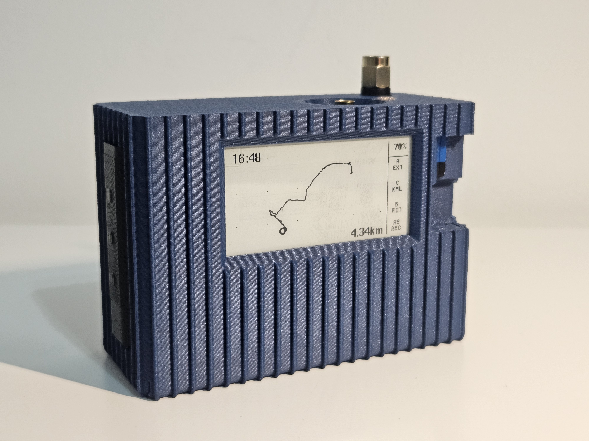
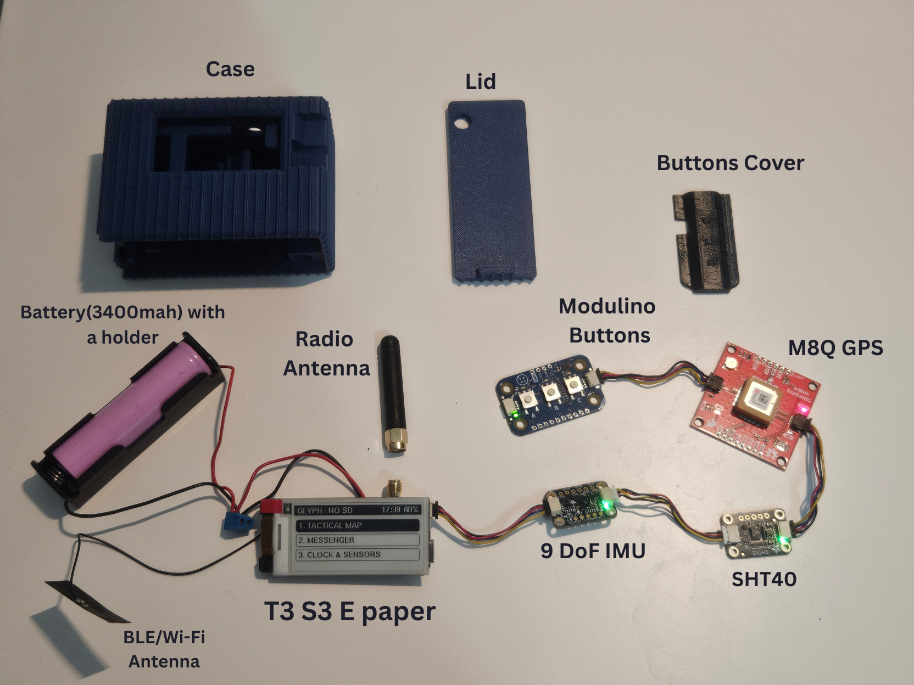
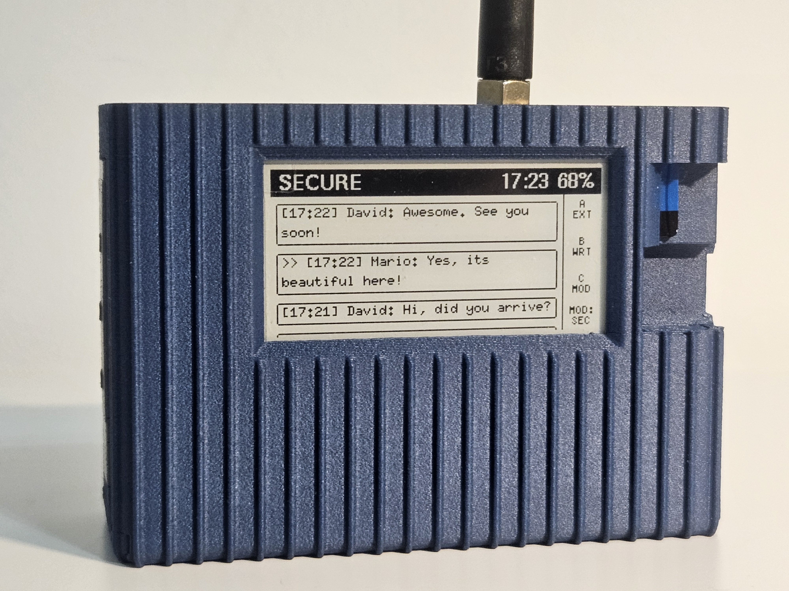
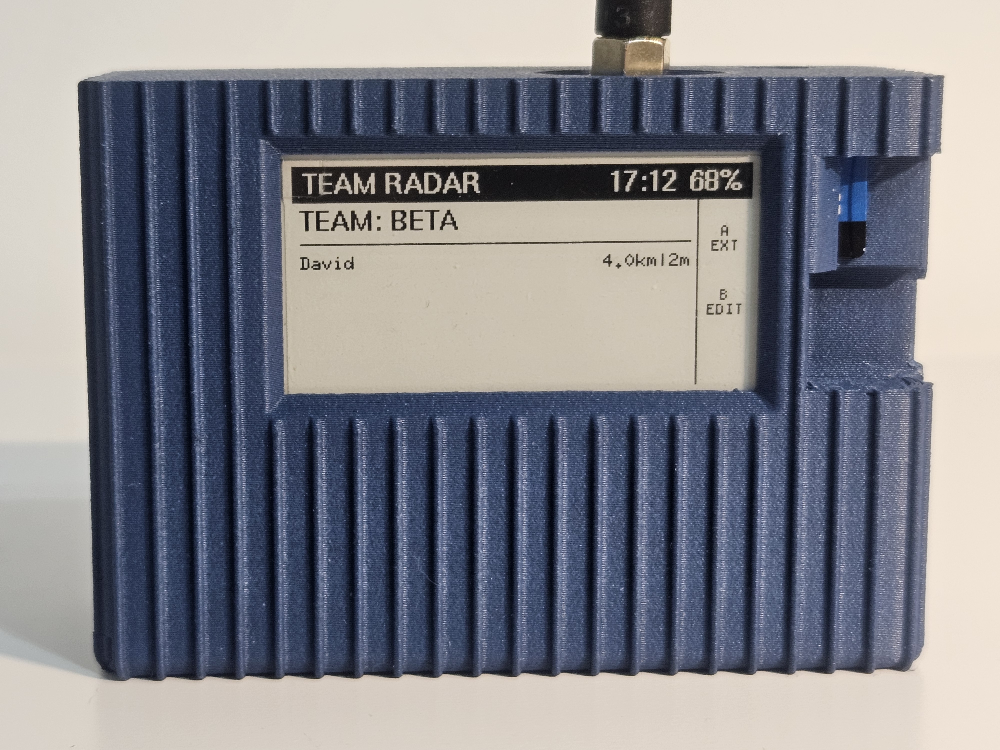
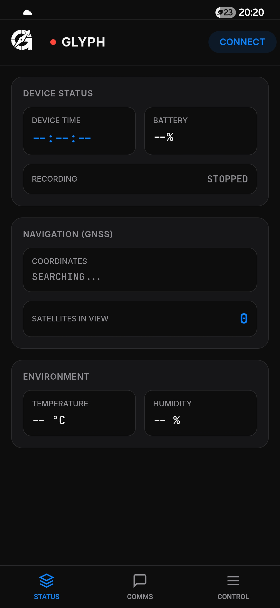
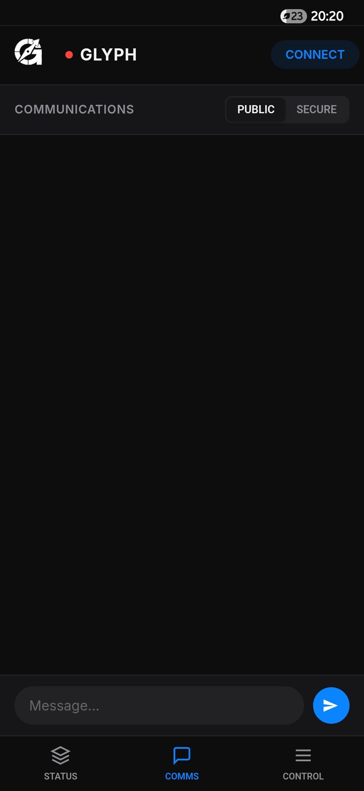
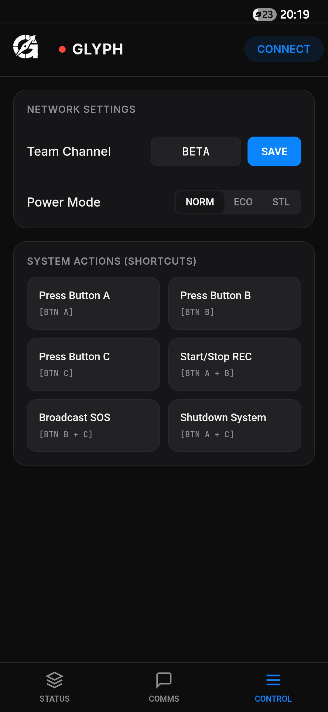

# 📡 GLYPH

### The 100% Plug & Play Tactical Communicator

  
  
  
  
  
  

**An ESP32-S3 dual-core tactical operating system for extreme operations.** Military-grade AES-256-CBC encryption • Offline GNSS navigation • Real-time team tracking • Ultra-low-power E-Ink display • Multi-language support.

**Build your own off-grid military-grade communicator in under 30 minutes using standard Qwiic modules and a 3D printer. No soldering required.**

 [📖 Documentation](#-documentation) • [🧰 Bill of Materials](#-hardware--bill-of-materials) • [🐛 Report Bug](https://github.com/Mqr1oo/GLYPH/blob/main/Security.md)
---

## 📸 Screenshots & Demo

  <b>Meet GLYPH: Hardware & Navigation</b>  
  
  

  <b>System Internals & Tactical Interface</b>  
  
  
  

## 🎯 Why GLYPH OS?

GLYPH is a self-contained, off-grid communication system designed for scenarios where cellular networks fail - tactical operations, extreme hiking, search & rescue, and disaster response. Think of it as a **military-grade walkie-talkie meets GPS tracker**, heavily focused on secure LoRa messaging and highly accurate GPS breadcrumbs.

The revolutionary aspect? **It's entirely Plug & Play.** We designed GLYPH so that anyone with a 3D printer can build their own tactical communication device in around 30 minutes. **No soldering iron. No technical skills required. Just plug and go.**

- 🔌 **True Plug & Play** - Uses Qwiic connectors throughout. Assemble it in ~30 minutes.
- 🔒 **Military-Grade Encryption** - AES-256-CBC with SHA-256 key derivation from team names.
- 📡 **Long-Range LoRa** - 10km+ range without any infrastructure (up to 20km in emergency mode).
- 🗺️ **Offline GPS Tracking** - Smart breadcrumb trail, KML routing, and PC web-viewer support.
- 👥 **Team Awareness** - Track 5 teammates entirely offline based on LoRa coordinates.
- 🔋 **Intelligent Power Management** - 32h (TACTICAL) → 40h (ECO) → 6 days (STEALTH) → ~70 days (DEEP SLEEP).
- 🖨️ **Bambu Lab Optimized** - Rugged PETG CF body with TPU button caps via AMS.
- 🌍 **Multi-Language & Timezones** - 11 languages supported with adjustable UTC offsets.

---

## 📑 Table of Contents

- [🔥 Core Capabilities & Menus](#-core-capabilities--menus)
- [📱 Companion App](#-companion-app)
- [🥷 Power Management](#-power-management)
- [🧰 Hardware & Bill of Materials](#-hardware--bill-of-materials)
- [🆘 Emergency Features & Shortcuts](#-emergency-features--shortcuts)
- [📄 License](#-license)

---

## 🔥 Core Capabilities & Menus

### 🗺️ Menu 1: Tactical Map & Navigation

**Smart GPS Breadcrumb System**
- **Live Tracking UI:** Displays recording status, current time, kilometers traveled, and heading direction.
- **Noise Filtering:** Only records true movement, filtering out GPS drift.
- **Breadcrumb Buffer:** Stores up to 350 waypoints in RTC memory.
- **Data Logging:** SD card automatically stores KML route files, text files for message archives, and a CSV file logging system telemetry every minute.

**Route Manager & KML Overlay**
- **File Manager:** A submenu allows you to view saved routes with their dates and timestamps.
- **Tactical Overlay:** Select a previously completed route from the list and overlay it on the screen to navigate back via the exact same path.
- **PC Integration:** KML files saved on the SD card can be viewed natively on a PC using tools like [Glandnav KML Viewer](https://glandnav.com/tools/kml-viewer).

**Zoom System**
| Zoom Level | Description | Use Case |
|------------|-------------|----------|
| **FIT** | Auto-zoom to show entire route + KML | Route overview, mission planning |
| **ZOOM** | Fixed ~20m radius around position | Close navigation, tactical ops |

### 📡 Menu 2: Encrypted LoRa Messenger
- **Private Mode (AES-256-CBC):** Highly secure mode where your Team Name acts as the encryption key. Only users with the exact same Team Name can read the messages.
- **Public Mode:** Unencrypted broadcasts. You can see messages from other devices operating in public mode, even if they aren't on your team.
- **Input Methods:** Type messages using the physical device keyboard or via Bluetooth using the Companion App.

### 🌡️ Menu 3: Sensor Telemetry
Live dashboard displaying: Current Time, Date, GPS Location, Altitude, Visible Satellites, Temperature, and Humidity.

### 👥 Menu 4: Team Radar
- **Live Squad Tracking:** Track up to **5 teammates** simultaneously.
- **Data Extraction:** Calculates distance to teammates based on the coordinates embedded in their last received message.
- **Configuration:** Set and change your Team Name directly from this menu or the Companion App.

### ⚙️ Menus 5, 6 & 7: System Settings
- **Menu 5 (Power Mode):** Toggle between Normal, Eco, and Stealth profiles.
- **Menu 6 (Language):** Choose between 11 localized languages.
- **Menu 7 (Timezone):** Set your local UTC offset (e.g., UTC+2, UTC-5).

---

## 📱 Companion App

GLYPH pairs with a custom mobile application via BLE for enhanced control and situational awareness. 

  
  
  

- **Status Dashboard:** View real-time device telemetry on your phone (Date, Time, Battery Level, Location, Satellites, Temp, and Humidity).
- **Coms Interface:** Chat seamlessly with other GLYPH users (Public or Secure mode) using a familiar messaging app interface.
- **Remote Control:** Select your Team Name, switch Power Modes, and configure the device directly from your phone screen.

---

## 🥷 Power Management

**Intelligent Multi-Mode System (Menu 5)**

| Mode | BLE | GPS | LoRa | Battery* | Details |
|------|-----|-----|------|----------|---------|
| **🎯 NORMAL** | **ON** | Max Power | Active | ~32h | Full operational capability |
| **🌲 ECO** | **OFF** | Power Save | Active | ~40h | Extended range patrols |
| **🥷 STEALTH** | **OFF** | Power Save | **OFF** | ~6 days | Radio silence, zero emissions |

*\* Based on 3400mAh 18650 Li-Ion battery.*

**Advanced Power Saving**
- **Auto-Standby:** When a route is not being recorded, the device quickly drops into a standby state to reduce consumption, waking instantly upon detecting movement.
- **Deep Sleep (Shutdown):** Triggered by pressing `A+C`. The board completely shuts down and enters deep sleep. It wakes up once every 8 minutes for 4 seconds to check the IMU (movement) or button states. Estimated battery life in this state is **~70 days**.

---

## 🧰 Hardware & Bill of Materials (160-190 EURO)

All modules connect using standard Qwiic cables - zero soldering required.

| Component | Description |
|-----------|-------------|
| **LilyGO T3S3 E-Paper** (868MHz or 915MHz) | ESP32-S3 with LoRa and E-Ink display integrated |
| **SparkFun GNSS Breakout - SAM-M8Q** (Qwiic) | GPS module |
| **Adafruit LSM6DSOX + LIS3MDL** (Qwiic) | 9-axis IMU with magnetometer |
| **Adafruit SHT40** (Qwiic) | Temperature & humidity sensor |
| **Arduino Modulino Buttons** (Qwiic) | 3-button interface |
| **5× Qwiic cables** (5cm) | Plug-and-play connections |
| **18650 Li-Ion battery** (3400mAh, 3.7V) | Standard rechargeable cell |
| **18650 battery holder** | With screw terminals |
| **ARK connector** (3.5mm, 2-pin) or screw terminal | For power connection |
| **MicroSD Card** | For storing routes/logs (8GB/16GB) |

### The 3D Printed Enclosure - From Bambu Lab (~80 EURO)
The enclosure specifically leverages Bambu Lab's AMS system for professional, multi-material capabilities:
- PETG CF filament (enclosure body)
- TPU filament (button caps)

---

## 🆘 Emergency Features & Shortcuts

Physical button combinations provide instant access to critical features:

- **[ A + B ] Toggle Recording:** Instantly starts or stops the KML route tracking to the SD card.
- **[ B + C ] SOS Broadcast:** Triggers a distress signal. Broadcasts an SOS message with your exact coordinates to all nearby devices.
- **[ A + C ] Deep Sleep / Shutdown:** Safely shuts down the board into the ultra-low-power 70-day deep sleep mode.

---

## 📄 License

Distributed under the **GPL v3**. See `LICENSE` file for details.

**Built with ❤️ for operators, adventurers, and survivalists**

*"When all other systems fail, GLYPH persists."*

[⬆ Back to Top](#-glyph)

