

# GLYPH

### Off-grid messenger, GPS navigator and team radar in your pocket

No SIM card. No mobile signal. No servers. 
GLYPH units talk to each other over LoRa radio, and the phone app turns yours into a full map and chat screen.

  
  
  
  
  

**[⬇️ Download the app](https://github.com/Mqr1oo/GLYPH/releases/latest)** &nbsp;·&nbsp;
**[🔒 Firmware](firmware/README.md)** &nbsp;·&nbsp;
**[✨ What's new](CHANGELOG.md)** &nbsp;·&nbsp;
**[🛠️ Build your own](#-build-your-own)**

 

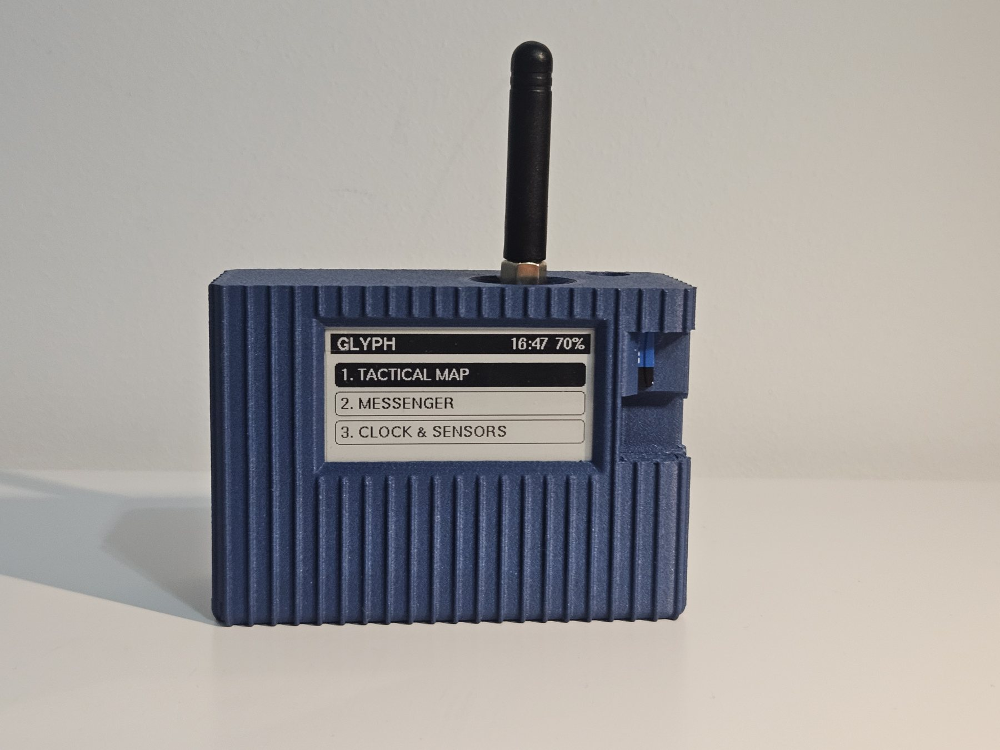

---

## 🧭 What is GLYPH?

GLYPH is a pocket-sized handheld for places where phones stop working: mountains, forests,
festivals, boats, or a city after a blackout. Every unit has an **e-ink screen**, a **GPS**, a
**LoRa radio** and a battery that lasts for days. Units find each other on their own, pass messages
along for one another, and show where your team is, all without any network.

Pair it with your phone and you get a modern app on top: a detailed map of the whole world,
routes you plan at home and follow on the trail, a chat that looks like any messenger, and every
setting of the device in one place.

<table>
<tr>
<td width="33%" valign="top">

### 💬 Message without signal
Public chat with every GLYPH nearby, or a **secure team channel** encrypted with AES-256.
Messages hop through other units (mesh), and you see when a teammate's unit has received yours.

</td>
<td width="33%" valign="top">

### 🗺️ Navigate anywhere
Plan a hike, ride or drive in the app, send it to GLYPH and follow it on the e-ink map.
Every track you walk is recorded to the memory card as KML.

</td>
<td width="33%" valign="top">

### 👥 See your team
Team radar shows how far away each teammate is, on the device and on the phone map. **SOS** sends your position
to every unit in range and keeps sending until it is cancelled.

</td>
</tr>
<tr>
<td valign="top">

### 🔋 Days on one charge
E-ink only uses power when the screen changes. Three power modes, from full features
to radio silence, plus a deep sleep that lasts for months.

</td>
<td valign="top">

### 🔌 Built in 30 minutes
Standard plug-in modules and a 3D-printed case. **No soldering, no tools**, no electronics
experience needed.

</td>
<td valign="top">

### 🔄 Always up to date
GLYPH updates itself over Wi-Fi, and the app installs firmware over a USB-C cable
straight from your phone. No computer needed.

</td>
</tr>
</table>

---

## 📱 The app

The GLYPH app for Android does the heavy lifting the small screen can't: maps, route planning,
long conversations and settings. It works fully offline once it is installed.

  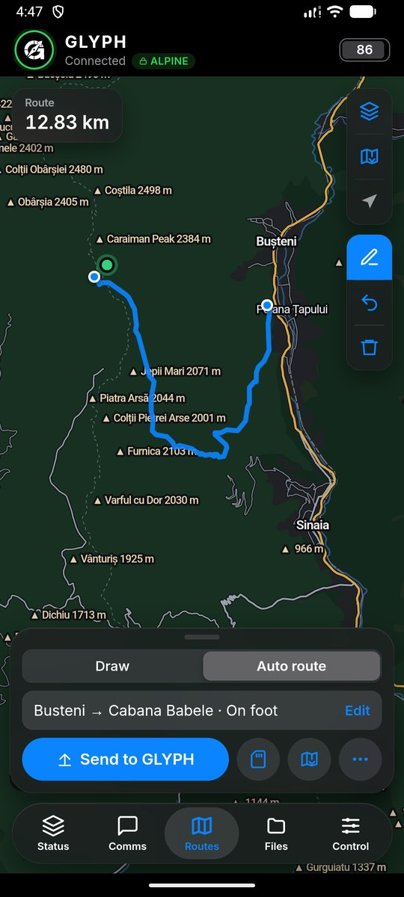
  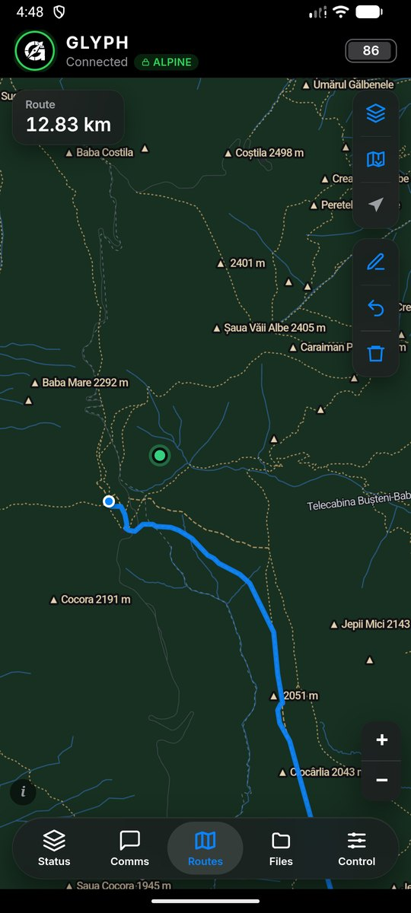
  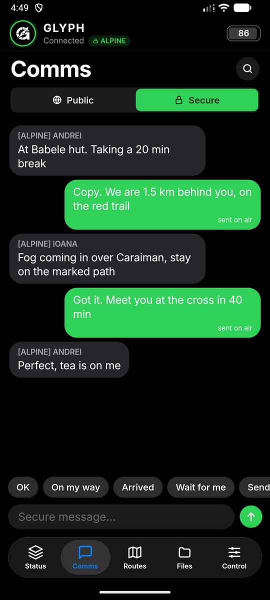
  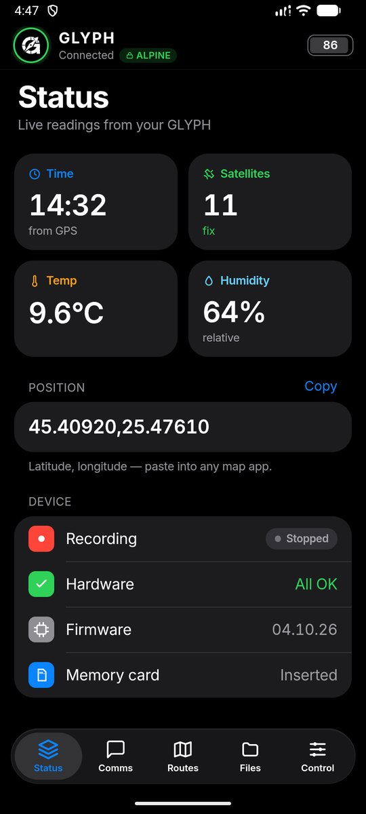

  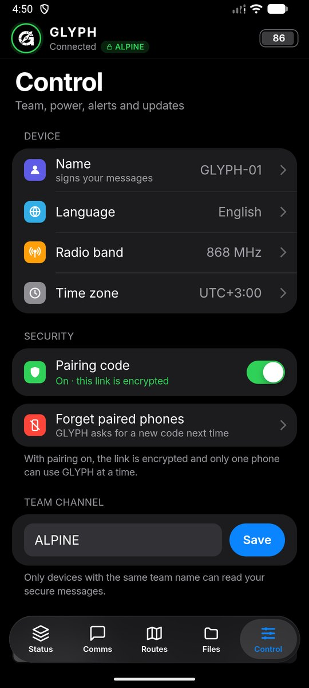
  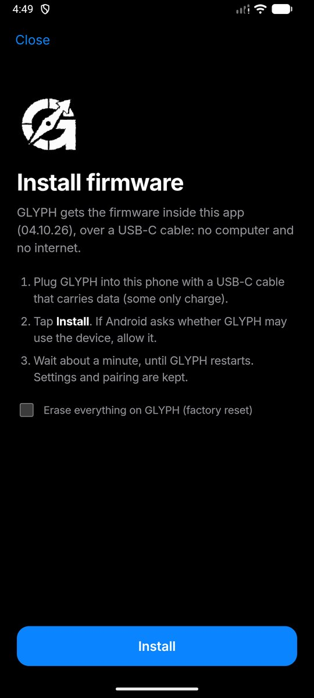

| Tab | What it does |
|---|---|
| 🗺️ **Routes** | A **detailed dark map of the whole world**: streets, hiking trails, forest tracks, peaks with their height, rivers and huts. Plan routes on foot, by bike or by car (they avoid ferries and stay on land), or draw your own. Send a route to GLYPH's **internal memory** with one tap, or to its memory card. |
| 📦 **Offline maps** | **Save area** keeps what you see on screen for use with no signal. **Save for this route** keeps a 2 km band along your route. Without signal you still get a world map with towns, forests and borders. |
| 💬 **Comms** | Public and Secure chat, quick replies, search, and a delivery status on every message. |
| 📊 **Status** | Time, satellites, temperature, humidity, position (tap to copy), recording state and a hardware health check. |
| 📁 **Files** | Tracks recorded by the phone and the device, KML import and export, and **books** you can send to GLYPH to read on the e-ink screen. |
| ⚙️ **Control** | Name, language (11), radio band and time zone, encrypted pairing, team channel, power mode, alerts, range check, diagnostics and firmware updates. |

The app connects over Bluetooth, keeps the link in the background, and shows your trip in a live
notification. It has no account, no ads and no tracking. See the [privacy policy](PRIVACY.md).

---

## 📟 On the device

  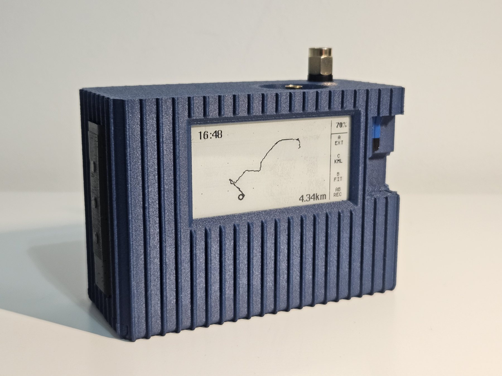
  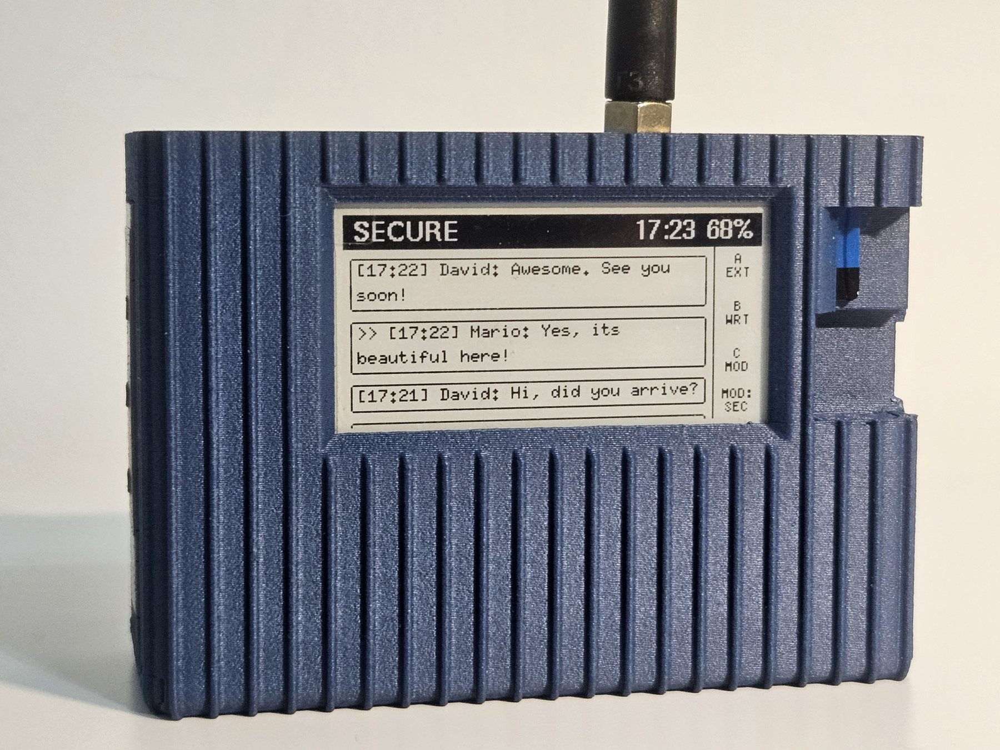
  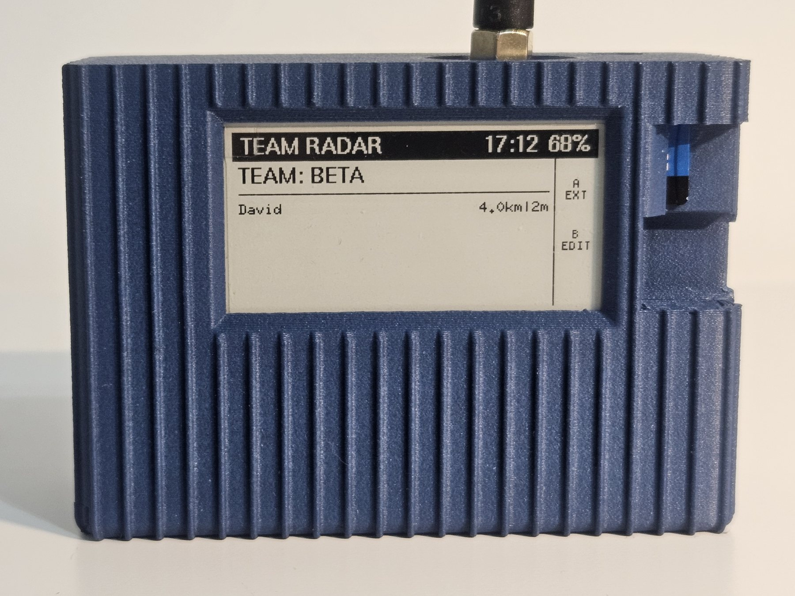

- **Tactical map**: your live track, distance, heading, and a route sent from the app drawn on top. FIT shows the whole route, ZOOM about 20 m around you.
- **Messenger**: read and write with the three buttons, or from the app.
- **Sensors**: time, date, position, altitude, satellites, temperature and humidity.
- **Team radar**: up to 5 teammates, with their distance from their last message.
- **Books**: read novels sent from the app. C turns the page.
- **Settings**: power mode, 11 languages and your time zone, or set it all up from the phone.

### Button shortcuts

| Press together | What it does |
|---|---|
| **A + B** | Start or stop recording your track |
| **B + C** | **SOS**: broadcast your position to every unit in range, until cancelled |
| **A + C** | Deep sleep. GLYPH wakes when it is moved or a button is pressed |

---

## 🔗 How it works

  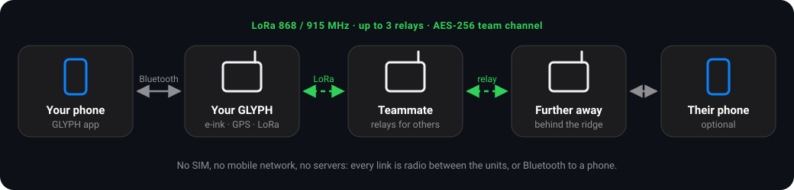

- Messages travel over **LoRa**, a long-range, low-power radio. Range is **10 km and more with a clear line of sight**, less in forests and valleys.
- Each message can be **relayed by up to 3 other units** (4 for an SOS), so the team stays in touch around ridges and buildings.
- The **secure channel** uses AES-256-GCM. The team name is the key, and only units with the same team name can read the messages or place each other on the radar.
- The phone link uses **Bluetooth with a pairing code**, encrypted, one phone at a time.

---

## 🚀 Getting started

1. **Get a GLYPH**: [build one](#-build-your-own) in about 30 minutes, or wait for the kit (see [Roadmap](#-roadmap)).
2. **Install the app**: download `GLYPH-x.y.z.apk` from [Releases](https://github.com/Mqr1oo/GLYPH/releases/latest) and open it on your Android phone. Allow installs from your browser if Android asks.
3. **Install the firmware**: the app's first screen does it over a **USB-C cable**, with no computer and no internet. Enter the **access code** that comes with your GLYPH.
4. **Pair**: tap the GLYPH logo in the app and enter the code shown on the device. A short tour shows you around.
5. **Go outside.** From then on GLYPH updates itself over Wi-Fi, and the app updates itself too.

---

## 🛠️ Build your own

Every part connects with **Qwiic** plug-in cables. Nothing to solder.

  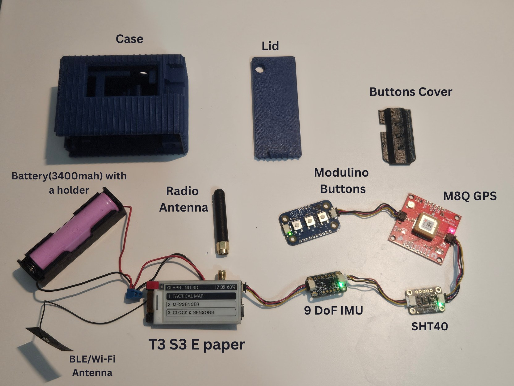

| Part | What it does |
|---|---|
| **LilyGO T3-S3 E-Paper** (868 or 915 MHz) | ESP32-S3 brain, LoRa SX1262 radio and 2.13" e-ink screen |
| **SparkFun GNSS SAM-M8Q** (Qwiic) | GPS |
| **Adafruit LSM6DSOX + LIS3MDL** (Qwiic) | 9-axis motion sensor and compass |
| **Adafruit SHT40** (Qwiic) | Temperature and humidity |
| **Arduino Modulino Buttons** (Qwiic) | The three buttons |
| **5 × Qwiic cables** (5 cm) | Connect everything |
| **18650 Li-ion cell** (3400 mAh) + holder | Power |
| **microSD card** (8–16 GB) | Tracks, messages and logs |

The full parts list, print settings and the diagnostic are in [`hardware/`](hardware/README.md).
The GLYPH firmware is installed from the app with the **access code that comes with every GLYPH**
(the kit and the print files will be on MakerWorld).

Parts cost about **160–190 €**. The case is printed in **PETG-CF** with **TPU** button caps,
tuned for Bambu Lab printers with an AMS. Pick 868 MHz in Europe and 915 MHz in the Americas and Australia.

### Battery life

| Mode | Bluetooth | GPS | LoRa | Battery* |
|---|---|---|---|---|
| 🎯 **Normal** | On | Full power | On | ~32 h |
| 🌲 **Eco** | Off | Power save | On | ~40 h |
| 🥷 **Stealth** | Off | Power save | Off | ~6 days |
| 💤 **Deep sleep** | Off | Off | Off | ~70 days |

* Estimates with a 3400 mAh 18650 cell.

---

## 📂 What's in this repository

| Folder | What it is |
|---|---|
| [`app/`](app/README.md) | 🔒 The Android app: download, features, permissions |
| [`firmware/`](firmware/README.md) | 🔒 The firmware: how it is installed and updated, versions |
| [`hardware/`](hardware/README.md) | Parts list, radio band, printing and assembly checks |
| [`diagnostic/`](diagnostic/README.md) | ✅ Open-source sketch that tests every module after assembly |
| [`docs/`](docs/guide.md) | The user guide, photos and screenshots |
| [`CHANGELOG.md`](CHANGELOG.md) | What changed in each version |
| [`PRIVACY.md`](PRIVACY.md) | The app's privacy policy |

🔒 = closed source: the code lives in a private repository, the app is published in Releases.

---

## 🗺️ Roadmap

- [x] Encrypted mesh messaging, team radar and SOS
- [x] Android app that works fully offline, with updates over the air
- [x] Detailed world map, offline areas and routes
- [x] Firmware install from the phone over USB-C
- [x] Firmware updates over Wi-Fi
- [ ] Ready-to-print model and a complete kit on **MakerWorld**
- [ ] GLYPH on **Google Play**
- [ ] iPhone app

⭐ **Star this repository** to follow along.

---

## 🔓 What's open

GLYPH is a product in development, so the main code is not public. Here is what you get:

| | What |
|---|---|
| ✅ **Free to download** | The Android app, in [Releases](https://github.com/Mqr1oo/GLYPH/releases) |
| 🔑 **Comes with your GLYPH** | The firmware, installed from the app with the access code that comes with every GLYPH |
| ✅ **Open source** | This documentation, the parts list, and the **GLYPH Diagnostic** sketch in [`diagnostic/`](diagnostic/README.md) that checks your modules after assembly (GPL-3.0) |
| 🔒 **Closed source** | The GLYPH firmware and the app |

---

## 🤝 Feedback and support

- Found a bug or have an idea? [Open an issue](https://github.com/Mqr1oo/GLYPH/issues).
- Found a security problem? Please report it privately, as described in [Security.md](Security.md).

## 📄 License

© 2026 Mqr1oo. All rights reserved. See [LICENSE](LICENSE).

 

**Built for hikers, climbers, sailors, search teams and everyone who goes where the signal doesn't.**

*When every other network is gone, GLYPH still talks.*

